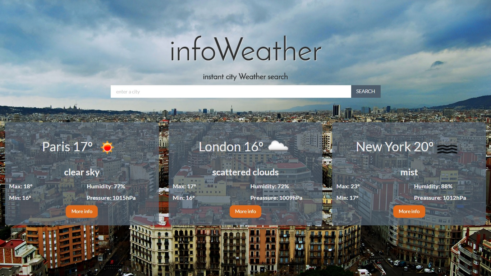

#INFO WEATHER

Front end project developed for the Web Developer Bootcamp at Skylab Coders. Summer 2017.

Project can be viewed at [piquant-faucet.surge.sh](http://piquant-faucet.surge.sh)

The app basically allows the user to do a search by city and displays its weather forecast using data from the mentioned api on screen.

### Technologies used
HTML5, CSS3, BOOTSTRAP, ANGULAR, JAVASCRIPT, SUBLIME TEXT3, GITHUB,
Node Package Manager(http-server).

API provided by [OpenWeatherMap.org](https://openweathermap.org/api)

Authors: 
[Ignasi Blanch](github.com/ignblanch)
[Dídac Tey](github.com/Toreex)

